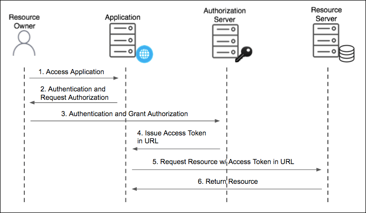
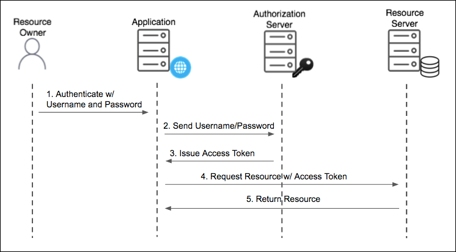
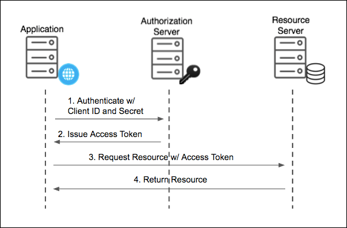
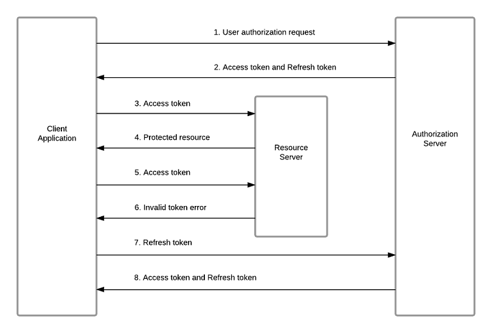

# OAuth2

OAuth 2.0, which stands for “Open Authorization”, is a standard designed to allow a website or application to access resources hosted by other web apps on behalf of a user. It replaced OAuth 1.0 in 2012 and is now the de facto industry standard for online authorization. OAuth 2.0 provides consented access and restricts actions of what the client app can perform on resources on behalf of the user, without ever sharing the user's credentials.

## OAuth2.0 Roles

The idea of roles is part of the core specification of the OAuth2.0 authorization framework. These define the essential components of an OAuth 2.0 system, and are as follows:

- **Resource Owner**: The user or system that owns the protected resources and can grant access to them.

- **Client**: The client is the system that requires access to the protected resources. To access resources, the Client must hold the appropriate Access Token.

- **Authorization Server**: This server receives requests from the Client for Access Tokens and issues them upon successful authentication and consent by the Resource Owner. The authorization server exposes two endpoints: the Authorization endpoint, which handles the interactive authentication and consent of the user, and the Token endpoint, which is involved in a machine to machine interaction.

- **Resource Server**: A server that protects the user’s resources and receives access requests from the Client. It accepts and validates an Access Token from the Client and returns the appropriate resources to it.

## OAuth 2.0 Scopes

Scopes are an important concept in OAuth 2.0. They are used to specify exactly the reason for which access to resources may be granted. Acceptable scope values, and which resources they relate to, are dependent on the Resource Server.

## OAuth 2.0 Access Tokens and Authorization Code

The OAuth 2 Authorization server may not directly return an Access Token after the Resource Owner has authorized access. Instead, and for better security, an Authorization Code may be returned, which is then exchanged for an Access Token. In addition, the Authorization server may also issue a Refresh Token with the Access Token. Unlike Access Tokens, Refresh Tokens normally have long expiry times and may be exchanged for new Access Tokens when the latter expires. Because Refresh Tokens have these properties, they have to be stored securely by clients.

## How Does OAuth 2.0 Work?

At the most basic level, before OAuth 2.0 can be used, the Client must acquire its own credentials, a _client id _ and client secret, from the Authorization Server in order to identify and authenticate itself when requesting an Access Token.

Using OAuth 2.0, access requests are initiated by the Client, e.g., a mobile app, website, smart TV app, desktop application, etc. The token request, exchange, and response follow this general flow:

1. The Client requests authorization (authorization request) from the Authorization server, supplying the client id and secret to as identification; it also provides the scopes and an endpoint URI (redirect URI) to send the Access Token or the Authorization Code to.
2. The Authorization server authenticates the Client and verifies that the requested scopes are permitted.
3. The Resource owner interacts with the Authorization server to grant access.
4. The Authorization server redirects back to the Client with either an Authorization Code or Access Token, depending on the grant type, as it will be explained in the next section. A Refresh Token may also be returned.
5. With the Access Token, the Client requests access to the resource from the Resource server.

## Grant Types in OAuth 2.0

In OAuth 2.0, grants are the set of steps a Client has to perform to get resource access authorization. The authorization framework provides several grant types to address different scenarios:

- **Authorization Code grant**: The Authorization server returns a single-use Authorization Code to the Client, which is then exchanged for an Access Token. This is the best option for traditional web apps where the exchange can securely happen on the server side. The Authorization Code flow might be used by Single Page Apps (SPA) and mobile/native apps. However, here, the client secret cannot be stored securely, and so authentication, during the exchange, is limited to the use of client id alone. A better alternative is the Authorization Code with PKCE grant, below.

- **Implicit Grant**: A simplified flow where the Access Token is returned directly to the Client. In the Implicit flow, the authorization server may return the Access Token as a parameter in the callback URI or as a response to a form post. The first option is now deprecated due to potential token leakage.

- **Authorization Code Grant with Proof Key for Code Exchange (PKCE)**: This authorization flow is similar to the Authorization Code grant, but with additional steps that make it more secure for mobile/native apps and SPAs.

[More details can be found here](https://auth0.com/docs/get-started/authentication-and-authorization-flow/authorization-code-flow-with-proof-key-for-code-exchange-pkce)

- **Resource Owner Credentials Grant Type**: This grant requires the Client first to acquire the resource owner’s credentials, which are passed to the Authorization server. It is, therefore, limited to Clients that are completely trusted. It has the advantage that no redirect to the Authorization server is involved, so it is applicable in the use cases where a redirect is infeasible.

- **Client Credentials Grant Type**: Used for non-interactive applications e.g., automated processes, microservices, etc. In this case, the application is authenticated per se by using its client id and secret.

- **Device Authorization Flow**: A grant that enables use by apps on input-constrained devices, such as smart TVs.

[More details can be found here](https://auth0.com/docs/get-started/authentication-and-authorization-flow/device-authorization-flow)

- **Refresh Token Grant**: The flow that involves the exchange of a Refresh Token for a new Access Token.

## References

- https://auth0.com/intro-to-iam/what-is-oauth-2
- https://docs.vmware.com/en/Single-Sign-On-for-VMware-Tanzu-Application-Service/1.14/sso/GUID-grant-types.html
- https://is.docs.wso2.com/en/5.9.0/learn/refresh-token-grant/
