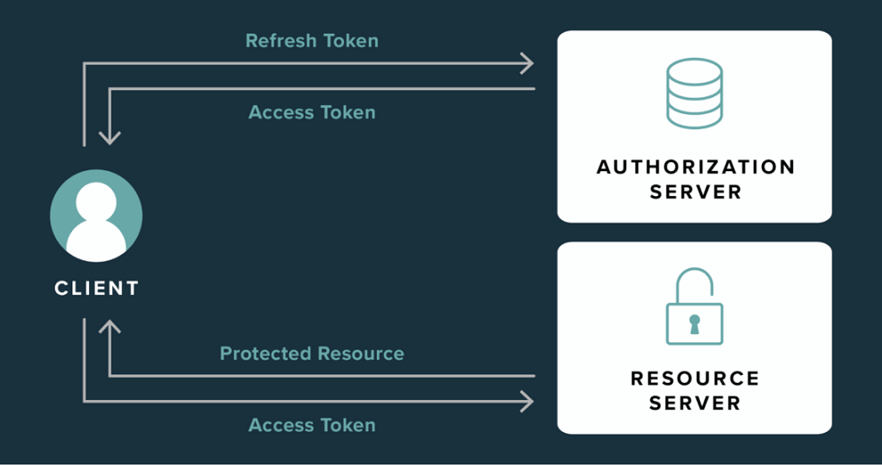

# KTOR demo

This application was generated using https://start.ktor.io/

| Branch |                                                                               Pipeline                                                                               |                                                                            Code coverage                                                                             |                                 Gradle test report                                 |                                 Jacoco test report                                 |                                 SonarCloud                                 |
|:------:|:--------------------------------------------------------------------------------------------------------------------------------------------------------------------:|:--------------------------------------------------------------------------------------------------------------------------------------------------------------------:|:----------------------------------------------------------------------------------:|:----------------------------------------------------------------------------------:|:--------------------------------------------------------------------------:|
|  main  |  |  | [link](https://showmeyourcodeyoutube.gitlab.io/ktor-demo/gradle-report/index.html) | [link](https://showmeyourcodeyoutube.gitlab.io/ktor-demo/jacoco-report/index.html) | [link](https://sonarcloud.io/organizations/showmeyourcodeyoutube/projects) |

---

The `KTOR demo` shows a simple project build with KTOR framework and related plugins to provide.

Apart from showing KTOR, it also discussed a few other topics:
- storing users in a database,
- issuing and validating JWT tokens ([OAuth2](OAUTH.md)).

| Endpoint                    | HTTP method | Description                  | Authentication      |
|-----------------------------|-------------|------------------------------|---------------------|
| /api/v1/users               | POST        | Create                       |                     |
| /api/v1/users/{userId}      | GET         | Get by ID                    | Basic Auth          |
| /api/v1/users/count         | GET         | Count registered users       | Basic Auth          |
| /api/v1/oauth2/authorize    | GET         | Obtain an authorization code |                     |
| /api/v1/oauth2/token        | POST        | Obtain a token               |                     |
| /api/v1/oauth2/token/status | POST        | Obtain token details         | JWT Auth            |
| /api/v1/oauth2/revoke       | POST        | Revokes an access token      | Client Secret Auth  |

*API design was inspired by:*
- [Square Developer](https://developer.squareup.com/reference/square/o-auth-api/authorize) - reference implementation,
- [Okta Developer](https://developer.okta.com/docs/guides/refresh-tokens/main/#example-request),
- [OAuth 2 Simplified](https://aaronparecki.com/oauth-2-simplified/).

All above requests are defined in the project's [Insomnia file](insomnia_ktor-demo.yaml).

The service doesn't use any external providers e.g. Auth0.

## Technology

- Kotlin
- KTOR
- Gradle
- Netty
- Flyway
- PostgreSQL / H2
- Exposed (ORM)
- Logback
- Kotlin Coroutines
- com.auth0 » java-jwt
  - Java implementation of JSON Web Token (JWT)
- org.jetbrains.kotlin » kotlin-test-junit

### Project's technology limitations

- `Exposed` framework uses JDBC which is blocking I/O. There is no active development for `R2DBC`. See: https://github.com/JetBrains/Exposed/issues/456

### KTOR

Ktor is a Kotlin framework that allow developers to write asynchronous clients and servers applications, in Kotlin. KTOR Github: https://github.com/ktorio/ktor

It was developed with Kotlin by Jetbrains, and it's already present in a web benchmark: https://www.techempower.com/benchmarks/

#### Advantages

1. Simple and light
    - Ktor is simple, everything is explicit, it has a great API, it’s built on coroutines, so it’s asynchronous from the ground up.
2. Not having to use services like Firebase.
    - Ever tried to build a large application that requires a backend? Well, if you don’t know backend development you probably used a service like Firebase, and it was probably very limited.
    - So, at some point, the pricing and scalability also become a problem. What do you do then? You either pay a lot of money, or you hire a backend developer to build your custom backend for you. Both ways are very expensive.
    - There is an easier and cheaper way, though. You can always learn Ktor and backend development, and build your own backend for free. Of course, hosting will still need some money, but it will be a lot cheaper than the previous two ways.

## JSON Web Token (JWT)

JSON Web Token (JWT) is an open standard (RFC 7519) that defines a compact and self-contained way for securely transmitting information between parties as a JSON object. This information can be verified and trusted because it is digitally signed. JWTs can be signed using a secret (with the HMAC algorithm) or a public/private key pair using RSA or ECDSA.

A bearer token is an Access Token passed to a server using the HTTP Authorization header. The actual token within a Bearer Token can be any series of characters that the server can decode. This means a JWT string can be passed as Bearer Token.

Here are some scenarios where JSON Web Tokens are useful:
- Authorization: This is the most common scenario for using JWT. Once the user is logged in, each subsequent request will include the JWT, allowing the user to access routes, services, and resources that are permitted with that token. Single Sign On is a feature that widely uses JWT nowadays, because of its small overhead and its ability to be easily used across different domains.
- Information Exchange: JSON Web Tokens are a good way of securely transmitting information between parties. Because JWTs can be signed—for example, using public/private key pairs—you can be sure the senders are who they say they are. Additionally, as the signature is calculated using the header and the payload, you can also verify that the content hasn't been tampered with.

Reference: https://jwt.io/introduction

## ID token vs Access token

The ID Token is a security token granted by the OpenID Provider that contains information about an End-User. This information tells your client application that the user is authenticated, and can also give you information like their username or locale.

You can pass an ID Token around different components of your client, and these components can use the ID Token to confirm that the user is authenticated and also to retrieve information about them.

Access tokens, on the other hand, are not intended to carry information about the user. They simply allow access to certain defined server resources.

Ref: https://developer.okta.com/docs/guides/validate-id-tokens/main/#what-to-check-when-validating-an-id-token

Ref: https://auth0.com/blog/id-token-access-token-what-is-the-difference/

## Access token vs Refresh token

Used within the OAuth 2.0 authorization framework, refresh tokens are a sophisticated method for controlling the length of user sessions within native, web-based, or single-page applications.

Essentially, refresh tokens allow a user to stay logged in for a longer period of time without having to repeat the authentication process, such as by entering their password.

*Refresh tokens have a longer lifespan (weeks, months, years, even infinite) and are used to automatically request a new access token from the authorization server when the current access token expires. It’s important to note that refresh tokens on their own do not provide the user with any access.*

Ref: https://stytch.com/blog/what-are-refresh-tokens/

## Storing passwords in database

Many years ago, it was standard practice to store passwords in plaintext in databases. This was a bad idea because, when the database was compromised, the attacker got all the passwords. To combat this, we started hashing passwords in the database using one-way cryptographic hash algorithms. MD5 became popular, but weaknesses (collisions, partial preimage, etc) discovered in it mean it's no longer recommended. A lot of people moved onto SHA1, which is more secure.

The problem with this approach is that it's possible to construct a huge table of hashes and their corresponding plaintexts. These are called rainbow tables. They work on the concept that it is more efficient to compute a huge list of hashes for all possible passwords (within a certain set) and then store it, so it can be quickly queried later on. So, instead of brute-forcing individual hashes, it became possible to just query the database for a hash and have its plaintext returned immediately.

In order to fix this, security nerds invented salts. Salts are large unique random values appended to passwords before they are hashed. This salt is stored with the hash, so that it can be computed again later. So, we compute H(m+s) = h, then store h and s in the database. This provides significant protection against rainbow tables because it essentially requires a separate rainbow table to be generated for each salt.

So, the bad guys switched back to dictionary attacks and brute-force cracking. With the advent of GPU computing, it became possible to compute billions of hashes per second on a moderately powerful graphics card. In fact, people have built computers that can compute nearly 50 billion MD5 hashes per second - pretty impressive / scary. The reason GPUs are capable of this is that they're designed to do huge numbers of parallel scalar operations. Scalar operations are math and logic operations that do not involve branches - i.e. they don't need to do much/any "if x then do y". Cryptographic hash algorithms tend to fit into this model.

In order to make this difficult, we have to make the hash operation slow enough to make brute forcing infeasible. Normal hash algorithms (e.g. SHA1) are designed to be fast, which makes them unsuitable for this purpose. HMAC adds very little overhead and no extra security margin, so it too isn't much use here.

Creating a slow cryptographic hash algorithm is easier said than done - it's very hard to come up with one that is slow, irreducible (i.e. cannot be optimised beyond its current state) and secure. There are three popular hash functions that can do this: PBKDF2, bcrypt, and scrypt.

Reference: https://security.stackexchange.com/questions/16809/is-a-hmac-ed-password-is-more-secure-than-a-bcrypt-ed-or-scrypt-ed-password

### HMAC hashing

HMAC (ang. keyed-Hash Message Authentication Code, Hash-based Message Authentication Code)

In cryptography, an HMAC is a specific type of message authentication code (MAC) involving a cryptographic hash function and a secret cryptographic key. As with any MAC, it may be used to simultaneously verify both the data integrity and authenticity of a message.

---

A HMAC hash algorithm is, essentially, just a keyed version of a normal hash algorithm. It is usually used to verify integrity and authenticity. The usual notation of this is `H(m,k) = h`, where H is the HMAC hash algorithm, m is the message, k is the key, and h is the resulting hash. The idea is that two parties that share a secret k can verify that the other person is the author of m. Furthermore, an attacker cannot forge a message hash without knowing k.

This is done as follows:
- Alice and Bob both know a shared secret key k.
- Alice writes a message m, and computes the HMAC hash of it using k, i.e. H(m,k) = h.
- Alice sends the message m and hash h to Bob.
- Bob computes H(m,k) and compares it to the hash h that Alice sent. If the hashes match, he knows that Alice sent the message, and that it was not altered after she hashed it.

### bcrypt vs HMAC

HMAC is designed to be very fast and is in this context a good way to add salt to password instead of just appending it. Bcrypt is much slower due to slow initialization, while scrypt is even slower than Bcrypt because it is intentionally designed in such a way. Scrypt is designed to make brute forcing it very computationally expensive. It consumes a lot of CPU, memory and is also slow to use on GPUs.

## Best practises

### Token Best Practices

https://auth0.com/docs/secure/tokens/token-best-practices
